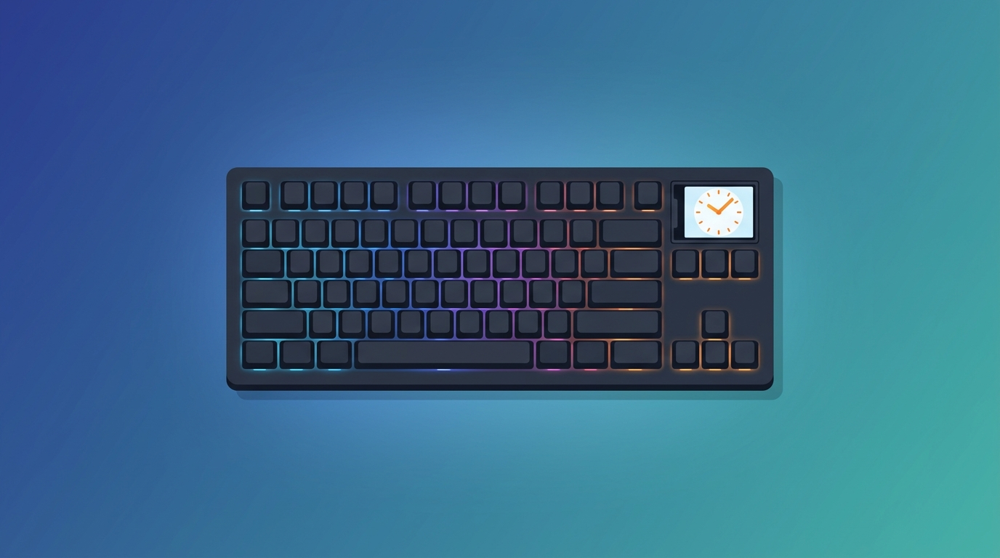

<div align="center">


-blueviolet?logo=usb&logoColor=white)


</div>

# ⌨️ Yunzii B75 Pro Max — native screen control for Linux

No browser needed. 🎉

The Yunzii B75 Pro Max keyboard has a small TFT screen (clock / picture /
GIF). The only configuration tool the vendor ships is a browser-based WebHID
app at [yunzii-game.com](https://yunzii-game.com/) (Chrome/Edge/Opera only,
no native Linux app) — it works, but it always needs a browser tab open.

This repo talks directly to the keyboard over `/dev/hidraw*`, no browser, no
WebHID, no tab to keep around.

```
USB ID 28e9:31c8  GDMicroelectronics YUNZII B75 PRO MAX Keyboard
```

---

## 🗺️ Status

**⏰ `set-time`, 🖼️ `switch-page`, 🧹 `clear-picture`, 🎨 `set-picture` and
🎞️ `set-gif` all work!** Their protocols are fully decoded (see
`PROTOCOL.md`), with native CLI commands, and every one is visually confirmed
on real hardware.

`switch-page` now takes `gif` too. Milestone 2 withheld it believing cmd15 did
not switch the panel; the real cause turned out to be the *save*, not the
switch -- the vendor's GIF save has three modes and every early test used mode
0 ("set it as the startup animation"), which stores frames somewhere that never
plays. `set-gif` uses mode 1, and the animation appears immediately.

**🖥️ There's a TUI now.** Run the binary with no subcommand. Sliders and
toggles (brightness, chroma, saturation, grayscale, "fuzzy", sharpening) aren't
implemented; each gets its own reverse-engineering pass first, same process as
`set-time` below. 🚧
---

## 🖥️ The interface

```bash
./target/release/yunzii-b75-tui        # no subcommand -> interactive
```

```
┌ Yunzii B75 Pro Max ───────────────────────────────────┐
│ ● /dev/hidraw5                                        │
├───────────────────────┬───────────────────────────────┤
│ > Set time            │  ▀▀▀▀▀▀▀▀▀▀▀▀▀▀▀              │
│   Show home page      │  ▀▀▀▀▀▀▀▀▀▀▀▀▀▀▀              │
│   Show picture page   │  mascot.gif                   │
│   …                   │  36 frames · 10 fps · ~45s    │
├───────────────────────┴───────────────────────────────┤
│ frame 12/36  ████████░░░░░░░░░░░░  33%   ~30s left    │
└───────────────────────────────────────────────────────┘
```

Three things the CLI cannot do:

- **A progress bar with a real countdown.** An upload is forty-five seconds of
  frame lines otherwise.
- **A preview.** It draws the frame the device will actually receive — after
  the stretch to 160×96, in half-blocks, two pixels per cell — so you see what
  the panel will show *before* sending it. Choosing a file only previews it;
  a second Enter uploads.
- **Cancel.** Esc stops between reports and during the firmware's own pauses.
  There is no abort in the protocol, so it warns that the animation is partial.

`←`/`→` on the confirm screen change the frame rate, the same as `--fps`.
The keyboard is re-scanned every two seconds when it is missing, and the
header says *why* it is missing — not found, permission denied, or two devices
matching — because the fix differs each time.

Every subcommand keeps working exactly as before; the subcommand used to be
required, so nothing that worked changes meaning. With stdin or stdout piped
the bare command prints help and exits instead of drawing a UI nobody can see.

---

## ⚡ Quick start

```bash
cargo build --release
sudo cp udev/99-yunzii-b75.rules /etc/udev/rules.d/
sudo udevadm control --reload-rules && sudo udevadm trigger
sudo usermod -aG plugdev "$USER"   # only if the node stays root-only; needs re-login
# unplug and replug the keyboard, then:
./target/release/yunzii-b75-tui set-time
./target/release/yunzii-b75-tui switch-page home    # or: picture, gif
./target/release/yunzii-b75-tui clear-picture
./target/release/yunzii-b75-tui set-picture logo.png
./target/release/yunzii-b75-tui set-gif mascot.gif --fps 12
./target/release/yunzii-b75-tui set-gif mascot.gif --dry-run   # what would happen
```

### 🎨 `set-picture`

Takes a **PNG or JPEG**. The panel is a fixed **160×96**, and the image is
stretched to fill it with nearest-neighbour sampling — the same as the
vendor's tool, which draws with image smoothing switched off. **Aspect ratio
is not preserved.** Crop or letterbox the file yourself first if that
matters.

- **Fully transparent** pixels become **black**. Partial transparency keeps
  its full colour — the alpha value is discarded, not blended, which is what
  the vendor does too. A logo with soft edges shows those edges at full
  colour against black; pre-flatten it yourself if you want them faded.
- **EXIF orientation** is applied, so phone photos are not uploaded sideways.
  Verified by a test with a real orientation-tagged JPEG, not assumed.
- The image is decoded **before** the keyboard is opened, so a missing or
  corrupt file says exactly that instead of failing with "device not found".
- Uploading **replaces** whatever picture was there, and **switches the panel
  to the picture page by itself** — you do not need `switch-page picture`
  afterwards. Verified on hardware from the home page: the clock stayed up
  during the upload and the image appeared when it finished.

An upload is 552 reports and takes a moment. Like `set-time`, a failure
partway through aborts rather than silently continuing, and it says so:
a half-finished upload leaves a partially-written frame on the panel, and
the fix is to re-run `set-picture` or run `clear-picture`.

`clear-picture` sends 32 reports (16 repeats), with the same partial-failure
caveat.

### 🎞️ `set-gif`

Takes an animated **GIF** and plays it on the panel.

- Frames are stretched to 160×96 the same way `set-picture` does. GIF frame
  position, transparency and **disposal** are applied, so optimised GIFs — the
  normal kind — work correctly.
- **`--fps` is literal frames per second**, 1–60. Without it, the GIF's own
  rate is used when its frame delays are uniform **and** land inside 1–60.
  Otherwise the upload falls back to 30 fps and says why — either the delays
  vary (and it names the average), or they ask for a rate the keyboard cannot
  store, such as a 10 ms delay wanting 100 fps or a 1500 ms delay wanting
  0.67 fps. The keyboard animates at **one** rate for the whole animation, so a
  GIF with varying delays cannot be reproduced exactly. A 2-frame GIF at 30 fps
  strobes — short animations want a low `--fps`.
- **160 frames maximum.** A longer GIF is an error, not a silent truncation.
  `--max-frames N` opts into uploading an evenly sampled subset, and the CLI
  warns that fewer frames at the same rate play faster, suggesting the `--fps`
  that keeps the original duration.
- **Uploading takes roughly a second per frame** — the device pauses three
  seconds every sixteenth frame, which looks like a flash write. The CLI prints
  an estimate up front and a line per frame, so it is visibly working.
- If an upload fails part-way the animation may be incomplete; re-run
  `set-gif`. Note `clear-picture` is *not* known to clear a GIF, and there is
  no `clear-gif` command yet.
- **`--dry-run`** decodes the file, reports the frame count, the rate it would
  use and how long the upload would take, then stops without contacting the
  keyboard. Worth it before a long one: a 160-frame GIF takes two and a half
  minutes to send, and this tells you what you would get in under a second.
  `set-picture` takes it too.

Unlike `set-picture`, this does **not** reproduce the vendor's pixel output
byte-for-byte, and `PROTOCOL.md` explains why: the vendor resamples each frame
through a browser canvas, which cannot be reproduced outside a browser. The
transport is byte-identical; the pixels are ours. For pixel art the result is
usually sharper than the vendor's.

The udev rule is limited to **interface 1**, the configuration channel this
tool talks to. That limit is the point: interface 0 is the keyboard itself, so
a rule matching on VID/PID alone would hand every process running as your user
a live keylogger. Widening it back to the whole device is a real regression,
not a convenience.

The rule matches the interface's `modalias`, which looks roundabout and is not.
Every `ATTRS{...}` in one udev rule must match the **same** parent device, and
`idVendor` lives on the USB device while `bInterfaceNumber` lives on the USB
interface below it — so the obvious spelling, combining the two, silently
matches **nothing at all**. The interface's `modalias` carries the vendor and
product IDs, which puts both conditions on one parent. Verified with
`udevadm test` against the real keyboard: of the four interfaces, only
interface 1 matches.

If the device nodes still come up `root:root` after replugging (the `uaccess`
tag does not apply on every desktop), add yourself to `plugdev`, then log out
and back in:

```bash
sudo usermod -aG plugdev "$USER"
```

Requires: [Rust](https://rustup.rs) 🦀 **1.88+** (for `bin/ci`'s `cargo` steps too),
the keyboard connected via USB-C (2.4G dongle / Bluetooth untested), and the
vendor's browser tab (if any) closed — WebHID and this tool can't hold the
device open at the same time.

---

## 🔧 Hardware

Built and tested against USB `28e9:31c8`, config channel usage page
`0xFF60` / usage `0x61` (standard QMK/VIA-style Raw HID, unnumbered
report). Device discovery matches the **exact** report-descriptor bytes
captured from this unit, not just VID/PID — a firmware revision with a
byte-identical config channel but different padding elsewhere would be
rejected rather than silently assumed compatible. Interface numbering
(which `hidraw*` node) can vary by machine/session — see `PROTOCOL.md` for
how to re-identify it on yours.

---

## 🔍 How the protocol was reverse-engineered

The vendor's config page talks to the keyboard over WebHID. Rather than
guessing at the byte format blind, this repo:

1. Hooks `HIDDevice.prototype.sendReport`/`sendFeatureReport` and the
   `inputreport` event on the live page (see `scripts/capture-hook.js`) to
   record every HID message exchanged with the device.
2. Cross-references those captures against the vendor's own client-side
   JavaScript (already loaded into the browser to render the page — not
   extracted from firmware or any protected asset), which contains the exact
   functions that build these commands.
3. Verifies the resulting byte-level model against real captured traffic with
   runnable scripts (`scripts/verify-checksums.js`, `scripts/check-coverage.js`,
   `scripts/check-raw-consistency.js`).
4. Resolves the remaining native-transport questions (does `write()` need a
   report-ID byte? how many ACKs?) empirically, against real hardware, once
   there's Rust code to test with.

See `PROTOCOL.md` for the decoded format, `fixtures/` for the decoded
per-capture evidence (checksums and structure independently re-verified
against the real device), and `fixtures/raw/` for minimally processed
capture logs — `scripts/check-raw-consistency.js` checks each of
`fixtures/cap1.json`, `fixtures/page-switch.json`, and
`fixtures/clear-picture.json` against its own raw log byte-for-byte, in
exact order.

---

## 📡 Protocol reference

| Opcode | Name | What it carries |
|--------|------|------------------|
| `0x40` | Info package | Constant header + inner CRC-16, per command |
| `0x41` | Data packet | The actual payload (e.g. `[hour, minute, second]`) |
| `0x42` | Finish | Constant, no payload — commits the group |

Every 64-byte report is checksummed with a plain byte sum (**not** a CRC):
`opcode + byte1 + byte2 + length + sum(payload)`, stored 16-bit
little-endian at bytes 4-5 — for **every** opcode.

> 📝 Milestone 3 corrected this. Bytes 4-5 used to be documented as an 8-bit
> checksum plus a reserved zero for `0x41`/`0x42`, and bytes 1-2 as reserved.
> Byte 4 was always right; byte 5 is the checksum's **high** byte, and bytes
> 1-2 carry the bulk **data offset**. Every earlier command had a sum under
> 256 and a zero offset, so the two models agreed — until picture upload,
> where byte 5 is non-zero in 551 of 552 reports. No shipped behaviour
> changed; the old fixtures still pass byte-for-byte.

> ⚠️ Native `write()` to `/dev/hidraw*` needs a **leading `0x00` byte**
> (65 bytes total) — this unnumbered-report interface still wants the
> synthetic report-ID byte on write, confirmed against real hardware.
> `read()` does **not** get that prefix back (64 bytes). See `PROTOCOL.md`
> for the full writeup.

Full field-by-field mapping: `fields.json` (machine-readable) and
`PROTOCOL.md` (human-readable prose, hand-maintained alongside it -- not
mechanically generated, so treat `fields.json` as the source of truth if
the two ever disagree).

**Debug flags** (not needed for normal use): `--debug-no-prefix` sends
without the leading `0x00` byte — confirmed not to work, kept only to
re-run that experiment if the device's behavior ever needs re-checking.
`YUNZII_DEBUG=1` prints every sent report and received ACK in hex.

---

## 📄 License

MIT — see `LICENSE`.
